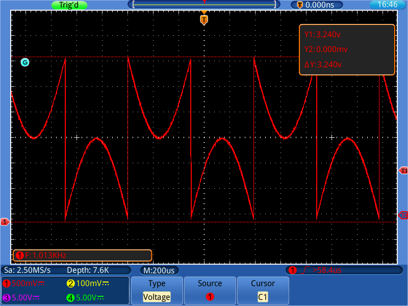
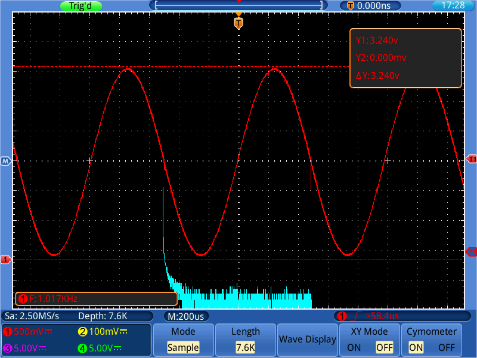
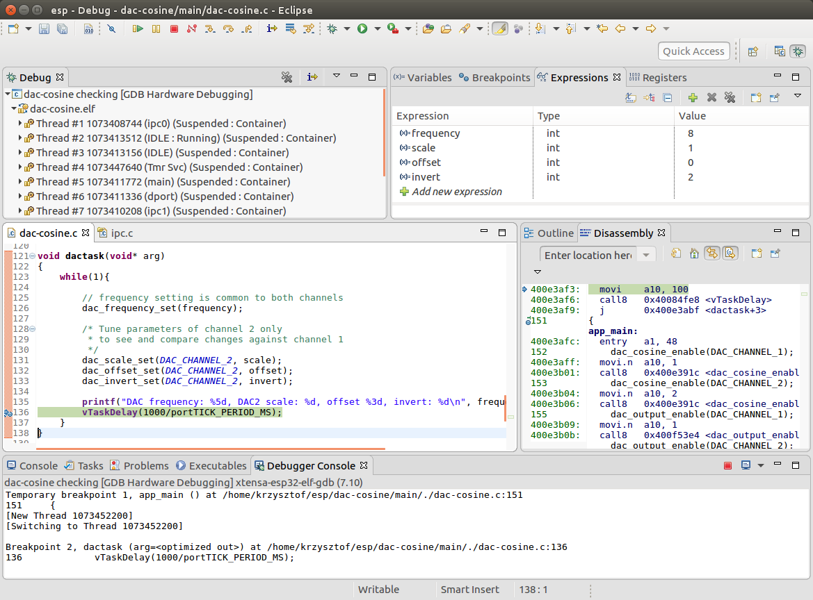
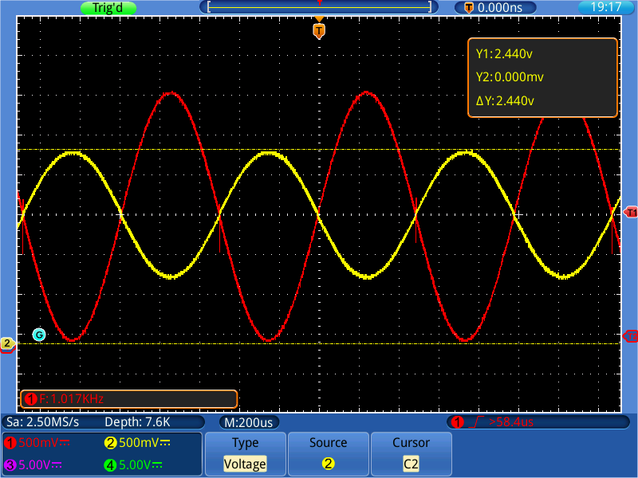
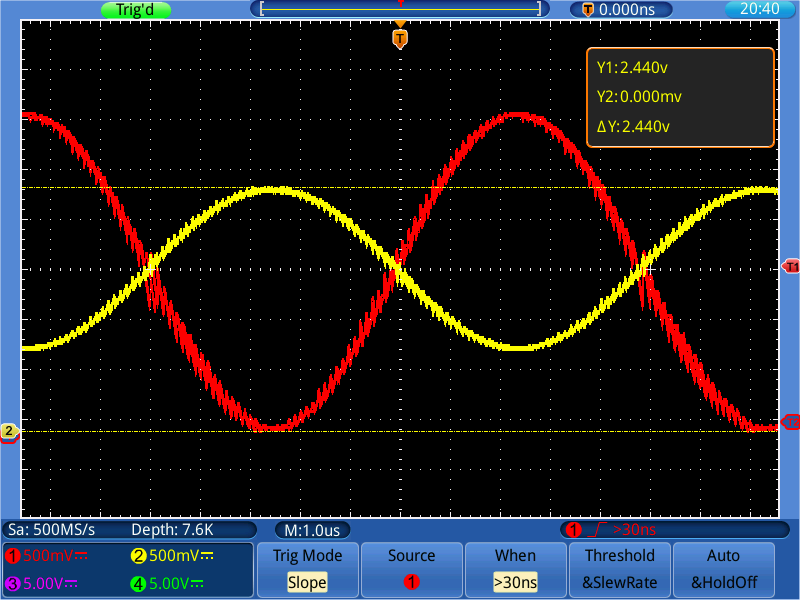
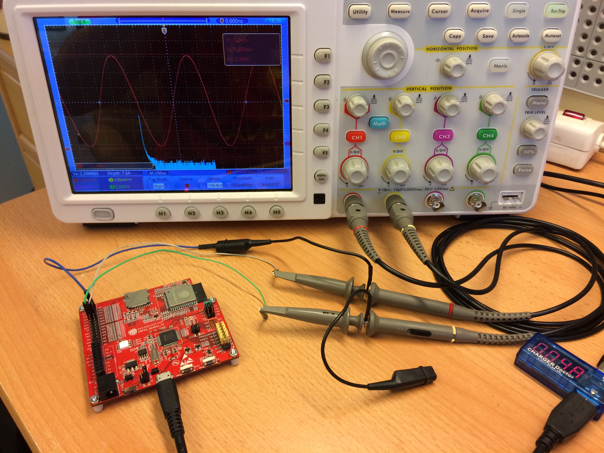

# dac-cosine


## Introduction

ESP32 is described by Espressif as [Wi-Fi + Bluetooth Combo Chip](https://espressif.com/en/products/hardware/esp32/overview). Besides the core wireless functionality it combines numerous other features like wired communication interfaces ranging from UART or I2S to CAN and Ethernet, several controllers like LED or MCPWM, as well as couple other building blocks including low noise amplifier, hall sensor or camera interface. Lurking in the shadows of these features is cosine waveform generator.

The purpose of this repository is to review functionality of ESP32's cosine waveform generator and develop a simple API to operate it. 


## Documentation is there

The cosine waveform (CW) generator is described in details in the [ESP32 Technical Reference Manual](http://espressif.com/sites/default/files/documentation/esp32_technical_reference_manual_en.pdf), but if we check API of [ESP-IDF](https://github.com/espressif/esp-idf), it has no any support implemented (as of July 2017). Fortunately, with commonly available information we can fairly easy put it into action.
 
Starting with ESP32 Technical Reference Manual, in chapter 24.7, we learn that the cosine waveform (CW) generator it is part of 8-bit DAC functional block and find the following functional diagram:

")
 
Diagram is showing "CW generator" box in upper left corner of diagram and two mux transfer blocks that are routed to DAC taking 8 bits on input on one side and providing `dacn_out` analog output on the other.
 
Besides CW, DAC is also accepting input from DMA, to generate arbitrary waveform, or from `RTCIO_PAD_DACn_REG` register to provide ordinary conversion of 8-bit numeric value. Several “n” letters on this diagram indicate either 1 or 2 because DAC has two channels.

 
## Check basic DAC functionality

To start with we should explore how ordinary conversion of 8-bit numeric values is performed. Checking [DAC API](http://esp-idf.readthedocs.io/en/latest/api-reference/peripherals/dac.html) in ESP-IDF, we will find couple of functions to enable DAC and output an analog value. Unfortunately these functions are not provided in source code. But checking further in [arduino-esp32](https://github.com/espressif/arduino-esp32) repository, we will find [esp32-hal-dac.c](https://github.com/espressif/arduino-esp32/blob/758553a786520b138307691e842e53b25606960b/cores/esp32/esp32-hal-dac.c) file that contains couple lines of code with comments that are behind Arduino `dacWrite` function. This should give us initial understanding which registers are used to provide digital value to be converted to analog output and how to enable or disable an output.  Checking further the [ESP32 Technical Reference Manual](http://espressif.com/sites/default/files/documentation/esp32_technical_reference_manual_en.pdf) and searching for `SENS_SAR_DAC_CTRL1_REG` we will easy find a “Register Summary” section 28.4, that provides this and other register names used in esp32-hal-dac.c with explanation of particular bits and functions.


## Use CW instead of ordinary DAC conversion

In next step, looking on ESP32 DAC Functional Diagram, we should figure out how to use CW generator block instead of `RTCIO_PAD_DACn_REG` register. Switching between these two is done with `SENS_DACn_CW_EN` bit. Searching for `SENS_DAC_CW` name, we will find it in ESP32 Technical Reference Manual under `SENS_SAR_DAC_CTRL2_REG` register together with explanation:

")

In other words setting `SENS_DAC_CW_EN1` bit will connect CW generator, clearing it will connect `PDAC1_DAC[7:0]` as the input source of DAC on channel 1. One extra crosschecking of this description against ESP32 DAC Functional Diagram and [esp32-hal-dac.c](https://github.com/espressif/arduino-esp32/blob/758553a786520b138307691e842e53b25606960b/cores/esp32/esp32-hal-dac.c) will confirm that this is what we are looking for.

After additional studying of fields of `SENS_SAR_DAC_CTRL1_REG` register we will also discover `SENS_SW_TONE_EN` bit that is enabling the CW generator itself.

The last component to complete this exercise is setting of generator's frequency. Applicable information is provided in first paragraph of “Cosine Waveform Generator” section in ESP32 Technical Reference Manual, that “The frequency of CW can be adjusted by register SENS_SAR_SW_FSTEP[15:0]”.


## Enable cosine generator on DAC channel 1

Now we are ready to write the code to use CW generator. To connect it to channel 1 (GPIO25), the code will consists of the following steps:


1.	Enable CW generator by setting `SENS_SW_TONE_EN` bit in `SENS_SAR_DAC_CTRL1_REG` register.

	```c
	SET_PERI_REG_MASK(SENS_SAR_DAC_CTRL1_REG, SENS_SW_TONE_EN);
	```

2.	Connect generator to DAC channel 1 by setting `SENS_DAC_CW_EN1` bit in `SENS_SAR_DAC_CTRL2_REG` register.

	```c
	SET_PERI_REG_MASK(SENS_SAR_DAC_CTRL2_REG, SENS_DAC_CW_EN1_M);
	```

3.	Set generator's frequecy by writing a value to `SENS_SAR_SW_FSTEP[15:0]` field in `SENS_SAR_DAC_CTRL1_REG` register.

	```c
	SET_PERI_REG_BITS(SENS_SAR_DAC_CTRL1_REG, SENS_SW_FSTEP, frequency, SENS_SW_FSTEP_S);
	```

4. Enable output on DAC channel 1 by calling API function [dac_output_enable()](http://esp-idf.readthedocs.io/en/latest/api-reference/peripherals/dac.html#_CPPv217dac_output_enable13dac_channel_t).

	```c
	dac_output_enable(DAC_CHANNEL_1);
	```

After uploading code to ESP32 and connecting a scope to DAC channel 1 (GPIO25) we should see a similar waveform:



The waveform looks promising but requires some extra bit tweaking.


## Fix the waveform

In initial waveform shown above the sinusoid halves are inverted. We should look for some additional configuration bits that let us revert the halves back. Further searching through DAC registers will reveal that `SENS_SAR_DAC_CTRL2_REG` register has two bit `SENS_DAC_INV` field with promising explanation:

- 00: does not invert any bits,
- 01: inverts all bits,
- 10: inverts MSB,
- 11: inverts all bits except for MSB.

This field currently contains default value of both bits cleared `00`, so we should try remaining three options by adding the following code:

```c
SET_PERI_REG_BITS(SENS_SAR_DAC_CTRL2_REG, SENS_DAC_INV1, invert, SENS_DAC_INV1_S);
```

Indeed, after setting `invert` bits to `10` (decimal 2), we will finally get expected sinusoidal waveform:



The blue waveform below is [FFT (Fast Fourier transform)](https://en.wikipedia.org/wiki/Fast_Fourier_transform), with strong initial peak we have been looking for.

The sinusoid itself has some random artifacts around zero and 180 phase, but I am not sure we can do anything about it. Later testing revealed no such artifacts at channel 2.


## What is the other functionality we can get?

[ESP32 Technical Reference Manual](http://espressif.com/sites/default/files/documentation/esp32_technical_reference_manual_en.pdf) specifies several parameters of CW we can adjust. It also provides applicable figure:

")

After checking of registers we should be able to compile complete list of fields to tweak:

- Frequency - `SENS_SW_FSTEP`
- Scale - `SENS_DAC_SCALE`
- Offset - `SENS_DAC_DC`
- Inversion -`SENS_DAC_INV`

Having four parameters to manage and check, it would be reasonable to write an user interface to make it easier to adjust individual values.

Before you rush to write the UI, I propose an easier and quicker way to examine all parameters in action.


## JTAG makes testing easier

ESP32 is equipped with JTAG functionality that together with [OpenOCD](https://github.com/espressif/openocd-esp32) software make it much easier to test and troubleshoot the ESP32 hardware and application.

In this particular case we can use JTAG + OpenOCD to stop application execution, apply CW parameter changes and resume execution to see how CW responds.

Check documentation how to install and operate JTAG under the following links:

- [ESP32 Programming Guide / API Guides / Debugging](http://esp-idf.readthedocs.io/en/latest/api-guides/openocd.html)
- [JTAG Debugging for ESP32 (PDF)](http://espressif.com/sites/default/files/documentation/jtag_debugging_for_esp32_en.pdf)

Clone this repository, build the code and load it to ESP32. Connect a scope to DAC channels 1 and 2 (GPIO25 and GPIO26).

The waveform on channel 1 will be set to default values of 1kHz frequecy without any scaling or offset. We will then tweak CW parameters on channel 2 to see how the output on this channel differs from the reference channel 1.

After running debugger establish a breakpoint inside main loop of `dactask()`. On 
"Expressions" tab add all CW parameters to tweak, see upper right corner of debugger window below.



Once ready you can change individual CW parameters. Then click "Resume" or press F8 to run the application. The application will use new parameter values and halt waiting for another change.

Below is an example of output of channel 1 (red trace = reference) and channel 2 (yellow trace) with scale set to 1/2 and inversion of all bits except MSB. 



JTAG interface operated from [Eclipse IDE](https://eclipse.org/) makes is easy and intuitive to interact with the application that has no user interface provided. Within couple of minutes it was possible to probe critical parameter and e.g. discover that at frequencies of around 100 kHz the waveform it is getting visible saw noise. The lowest frequency that can be set is around 125 Hz.




## Conclusion

ESP32 has on board cosine waveform generator with adjustable frequecy, scale and offset. The waveform has 8-bit resolution and can be output to GPIO25 (channel 1) and / or GPIO26 (channel 2) pins. Scale and offset can be set individually per channel. Frequency setting is common to both channels. The waveforms are generated by ESP32's hardware without any overhead on CPUs. 




## Contribute

Feel free to contribute to the project in any way you like!

If you find any issues with code or description please report them using *Issues* tab above.


## Credits

This small repository has been prepared thanks to great work of the following teams and individuals:

* Espressif team that develops and maintains [esp-idf](https://github.com/espressif/esp-idf) and [openocd-esp32](https://github.com/espressif/openocd-esp32) repositories.
* [Ivan Grokhotkov](https://twitter.com/i_grr) who provided tips how to operate CW generator.
* [robert-hh](https://github.com/robert-hh), developer of excellent tool [owonread](https://github.com/robert-hh/owonread) to get screen shots and track data data from Owon TDS series Oscilloscopes with Linux.


## License

[Apache License Version 2.0, January 2004](LICENSE)